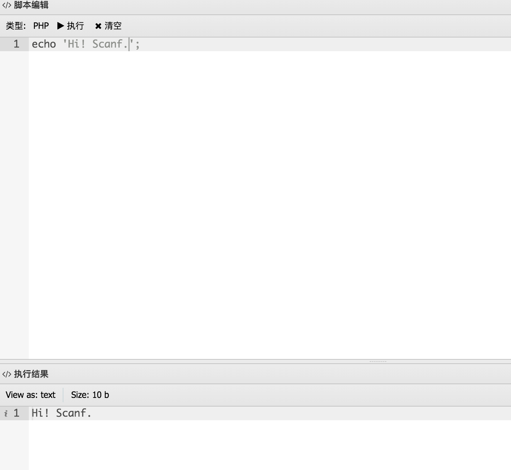

# AntSword ExecScript

> AntSword 执行自定义脚本

在目标主机上执行php、asp、aspx 自定义的脚本.

## 演示

* 辅助工具




## 安装

### 商店安装

进入 AntSword 插件中心，选择 ExecScript，点击安装

### 手动安装

1. 获取源代码

    ```
    git clone https://github.com/scanfsec/ExecScript.git
    ```
    

2. 拷贝源代码至插件目录

    将插件目录拷贝至 `antSword/antData/plugins/` 目录下即安装成功

## 相关链接

* [AntSword 文档](http://doc.u0u.us)
* [dhtmlx 文档](http://docs.dhtmlx.com/)
